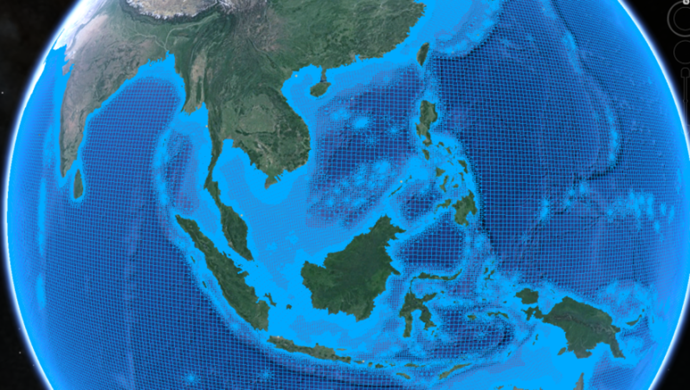

# GTSM-ERA5-E: an extended reanalysis dataset

## About the project
Extreme sea levels, driven by the combination of mean sea level, tides storm surges and waves, can drive coastal flooding. Global reanalysis of extreme sea levels have improved our understanding of the driving mechanisms of coastal flooding at large-scales. The reanalysis datasets have been used to estimate exceedance probabilities, which are valuable input for coastal flood risk assessment that are used for both disaster risks reductions and climate change mitigation and adaptation.

The [Global Tide and Surge Model (GTSM)](https://publicwiki.deltares.nl/display/GTSM/Global+Tide+and+Surge+Model) has been  is a depth-averaged hydrodynamic model, developed by [Deltares](https://www.deltares.nl/), with global coverage. GTSM is based on [Delft3D Flexible Mesh software](https://www.deltares.nl/en/software-and-data/products/delft3d-fm-suite/modules/d-flow-flexible-mesh) and has a spatially varying resolution which increases towards the coast. GTSM can be used to simulate water levels and currents, that arise from tides and storm surges. The model has showed to be able to simulate tides and storm surge with enough accuracy when forced with wind and pressure fields from the ERA5 climate reanalysis[^1][^2][^3].  

Currently, the GTSM-ERA5 reanalysis dataset, available at the [C3S Climate Data Store](https://doi.org/10.24381/cds.a6d42d60), covers the period 1979 to 2018. Considering the large decadal variability and the large uncertainties associated with fitting an extreme value distribution, this is a relative short. However, recently the ERA5 climate reanalysis was extended backwards to 1950, seamlessly joining with the dataset covering 1979 to the present. This provides the opportunity the extent the existing dataset and increase the length from 40 years to 70 years. 

### Goal
The goal of the project is to develop an automated workflow to produce an updated extreme sea levels dataset based on the extended ERA5 reanalysis.

## General workflow

The workflow makes use of the Global Tide and Surge Model version 3.0 (GTSMv3.0) to simulated the water levels and currents resulting from tides and storm surges. The w y run GTSM on Snellius. GTSM is forced with ERA5. Code for GTSMv3.0 near-real time simulations with ERA5 on Snellius (for Sea Level Monitor). In this paper, we present an extension of the previous reanalysis dataset published in 2020 tha covered the period 1979-201810. We use the same modelling chain, which consists of GTSMv3.0 in combination with tidal and meteorological forcing as well as mean sea level that annually updated. Leveraging recent updates of ERA5, we extend the data from 1950 to present-day. To achieve this, there was a need to develop semi-automated and portable workflow that can easily be used to deploy Global Tide and Surge Model (GTSM) on a high-performance computing cluster. We will discuss the methods, validate the dataset and explain the data formats. 

### File explanation

### Bash scripts
The bash scripts are used to define and run the several steps in the workflow. Each step consists of a separate bash script, which calls the relevant python script (or the Delft3D FM singularity container). The workflow.sh contains all steps and does not require specific user input, as the date is automatically retrieved (ensuring all input and output settings are correct).  The following bash scripts called by the workflow.sh script:
workflow --> automate with crontab/job

- `p1a_sbatch_download_era5.sh` takes care of downloading ERA5 data (see p1a download_CDS_ERA5.py below)
- `p1b_sbatch_download_tides.sh` takes care of downloading tide data (see p1b dowload_CDS_tides.py below)
- `p1c_checkout_gtsm3_cmip6.sh` checkout gtsm3_cmip6 repos to the `modelfiles` folder, this contains the modelfiles and template files (requires authentication, update to zenodo once published)
- `p2_sbatch_preprocess_ERA5.sh` converts the ERA5 data into FM inout format (see p2_preproc_meteo.py below)
- `p3_prepare_run.sh` prepares the GTSM run by copying models files from template (see p3_prepare_gtsm_run.py below)
- `p4_sbatch_postprocess.sh` converts to CDS format and plots the results of the simulations (see p4_postprocess_FM.py below)

### Python scripts
The Python scripts submitted by the bash script are used to download and preprocess the meteorological forcing, to prepare the GTSM simulations, and to postprocess the results. 

- `p1a download_ERA5.py` functionality to download ERA5 using the CDS API (note that a key-file is required)
- `p1b dowload_tides.py` functionality to download GTSM-tides using the CDS API (note that a key-file is required)
- `p2_preprocess_ERA5.py` functionality to convert downloaded data into suitable forcing input for a Delft3D FM model
    - correct longitude range [-180 to 180] and overlap
    - merge daily files to monthly including spinup
    - correct varnames and attributes
	- include spinup in yearly files
    - set initial timesteps to zero to allow for SLR correction
- `p3_prepare_run.py` functionality to prepare the GTSM model 
    - copy model files and use template to change folder paths
	- this scripts assumes `Tunit=S` in the mdu file
- `p4_postprocess_FM.py` functionality to proprocess GTSM simulation results
    - remove spinup
	- convert netcdf output into CDS appropiate format 
    - compute residual water levels and monthly/annual means
    - plotting results (min, max, mean) on global map
  
To be able to run the Python script you need to install conda and create an virtual environment using the environment.yml file (`conda env create --file environment.yml`). This installs the required packages, such as xarray, netCDF4, cartopy, etc. 

## Software
### Delft3D Flexible Mesh
Download a delft3dfm container from `p:\d-hydro\delft3dfm_containers` to the `fm_container` folder in `path_dict.py`

### Python 

## Data sources
We make use of various data sources. Whereas most of them are open and retrieval is automated and part of the scripts, there are some data sources for which retrieval is not automated yet. This because there are not available in open repositories or have been produced specifically for this project. These sources are desribed below. 

### ERA5
To be added

### Tides
To be added

### Mean sea level
The mean sea level is updated annually. The mean sea level files have been produced by Dewi Le Bars from KNMI. The period 1986-2005 is used as reference period. Sea level fields are computed from the sum of different contributors, including dynamic changes, thermal expansion, changes in gravitational fields, and contribution from glaciers and ice sheets. The different contributions are computed and combined using the probabilistic model described in Le Bars (2018). For the period 1950-2016, we use products based on observations for the Antarctic and Greenland ice sheets (Mouginot et al., 2019; Rignot et al., 2019), the glaciers (Marzeion et al., 2015), thermal expansion between 0 and 2000 m depth (Levitus et al., 2012), and climate-driven water storage (Humphrey & Gudmundsson, 2019). The ice sheets are assumed to be in equilibrium before 1979 for Antarctica and 1972 for Greenland because no data are available before these dates. For the period 2016-2050 we use sea-level rise projections based on the Fifth Assessment Report (AR5) of the Intergovernmental Panel on Climate Change (IPCC) for the RCP8.5 scenario (Church et al., 2013), very similar to the SSP585 scenario used by the models as above. The redistribution of water in the ocean due to wind changes and local steric effects is taken from the CMIP5 models (i.e. ‘zos’ field for the entire period). The fingerprints for the ice sheets, glaciers and land water storage are from the AR5 assessment, and include the gravitational, rotational and Earth elastic response. For the dynamics of the Antarctic contribution we use the re-evaluation presented in the IPCC’s Special Report on the Ocean and Cryosphere in a Changing Climate (SROCC) (Oppenheimer et al., 2019). Additionally, we add the glacial isostatic adjustment from the ICE-6G model (Peltier et al., 2015) but do not consider other processes of vertical land motion, such as subsidence or tectonics. The uncertainty in mean sea level is removed by selecting the median of the sea level observations and projections distributions. Note that at the time the GTSM simulation were carried out the SLR projections based on CMIP6 were not yet available. The files are converted to a pressure

### Vertical reference
The vertical reference of GTSMv3.0 is MSL, as defined in GEBCO bathymetry. To make the definition of MSL more consistent with the vertical reference used in the SLR fields, the mean sea-level pressure field (MSLP) over 1986–2005 is removed. The MSLP calculation is based on the ERA-Interim because ERA5 was not available at the time.

## Contact
Sanne Muis - sanne.muis@deltares.nl

More on GTSM: https://publicwiki.deltares.nl/display/GTSM/Global+Tide+and+Surge+Model
More on the Sea Level Monitor: xx

[^1]: Muis, S., Verlaan, M., Winsemius, H. C., Aerts, J. C. J. H., & Ward, P. J. (2016). A global reanalysis of storm surge and extreme sea levels. Nature Communications, doi:10.1038/ncomms11969.
[^2]: Dullaart, J. C., Muis, S., Bloemendaal, N., & Aerts, J. C. (2020). Advancing global storm surge modelling using the new ERA5 climate reanalysis. Climate Dynamics, doi:10.1007/s00382-019-05044-0
[^3]: Muis, S., Apecechea, M. I., Dullaart, J., de Lima Rego, J., Madsen, K. S., Su, J., ... & Verlaan, M. (2020). A High-resolution global dataset of extreme sea levels, tides, and storm surges, including future projections. Frontiers in Marine Science, doi:10.3389/fmars.2020.00263

