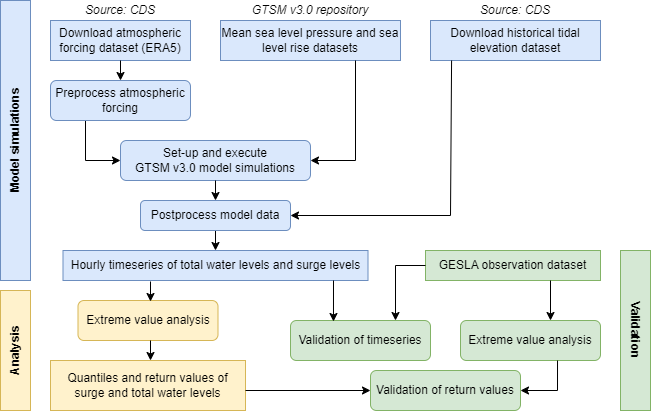

# GTSM-ERA5-E: an extended reanalysis dataset of global water levels

## About the project
Extreme sea levels, generated by storm surges and high tides and increasing with sea level rise, have the potential to cause coastal flooding and erosion. Global datasets are instrumental for mapping extreme sea levels and associated societal risks. 

Harnessing the backward extension of the [ERA5 reanalysis](https://cds.climate.copernicus.eu/cdsapp#!/dataset/reanalysis-era5-single-levels?tab=overview), we produced a dataset containing timeseries of tides and storm surges based on a global hydrodynamic model that covers the period **1950-2022**. The dataset is an extension of a previously published dataset that covered a shorter period (1979-2018). Using the extended dataset, we estimated extreme sea levels for various return periods globally. Validation showed that there is a good agreement between observed and modelled extreme sea levels. The extended 73-year dataset allows for a more robust estimation of return periods, often resulting in smaller uncertainties than its 40-year precursor. This underscores the necessity for long timeseries and highlights the strength of long-term modelling enabled by the ERA5 reanalysis database extension. The present dataset can be used for assessing flood risk, climate variability and climate changes. 

The background of the dataset will be described in more detail in the paper by Aleksandrova et al. (2024) [^1] (currently under review).

## About this repository
The goal of the project was to develop a reproducible workflow used to generate datasets of water level and surge timeseries, and to compute extreme water levels globally. The scripts in this repository were used to produce the GTSM-ERA5-E dataset and include the data processing necessary for the hydrodynamic model simulations, subsequent statistical data analysis and validation against observations. The different steps of the overall workflow are shown below.

## Model simulations
The main part of the workflow are the model simulations, which are used to produce hourly timeseries of total water levels and surge levels globally. We make use of the same modelling approach as presented in Muis et al. (2020,2023)[^2][^3]. We further develop a semi-automated and portable workflow that can easily be used to deploy Global Tide and Surge Model (GTSM) on a high-performance computing cluster. In this case we made use of the [Dutch National Supercomputer Snellius](https://www.surf.nl/en/dutch-national-supercomputer-snellius) by SURF. Snellius makes use of SLURM for managing and scheduling jobs on Linux clusters. 

### Hydrodynamic model
The modelling of global tides and surges is done by using the GTSMv3.0 model. The [Global Tide and Surge Model (GTSM)](https://publicwiki.deltares.nl/display/GTSM/Global+Tide+and+Surge+Model) is a depth-averaged hydrodynamic model, developed by [Deltares](https://www.deltares.nl/), with global coverage. GTSM is based on [Delft3D Flexible Mesh software](https://www.deltares.nl/en/software-and-data/products/delft3d-fm-suite/modules/d-flow-flexible-mesh) and has a spatially varying resolution which increases towards the coast. GTSM can be used to simulate water levels and currents, that arise from tides and storm surges. The model has showed to be able to simulate tides and storm surge with enough accuracy when forced with wind and pressure fields from the ERA5 climate reanalysis[^4][^5].  

### Bash scripts
The model simulation consists of a sequence of bash scripts with SLURM commands that calls the relevant python scripts (or the Delft3D FM singularity container in case of model simulations).

- `p1a_sbatch_download_era5.sh` - for downloading ERA5 data (see p1a download_CDS_ERA5.py below)
- `p1b_sbatch_download_tides.sh` for downloading tidal data (see p1b dowload_CDS_tides.py below)
- `p1c_checkout_gtsm3_cmip6.sh` checkout gtsm3_cmip6 repos to the `modelfiles` folder, this contains the files needed to run the GTSM model and template files for model settings 
- `p2_sbatch_preprocess_ERA5.sh` converts the ERA5 data into FM input format (see p2_sbatch_preprocess_ERA5.py below)
- `p3_prepare_run.sh` prepares the GTSM run by copying model input files and adjusting the template (see p3_prepare_run.py below)
- `p4_sbatch_postprocess.sh` converts model output to timeseries files containing 10-min total water levels and surge levels (see p4_postprocess_FM.py below)
- `p5a_sbatch_resample.sh` resamples 10-min timeseries to hourly timeseries (see p5a_resample_TS.py below)
- `p5b_sbatch_resample_dailymax.sh` resamples 10-min timeseries of total water levels to daily maxima timeseries (see p5b_resample_TS_DailyMax.py below)

### Python scripts
The Python scripts submitted by the bash script are used to download and preprocess the meteorological forcing, to prepare the GTSM simulations, and to postprocess the results. 

- `p1a download_ERA5.py` functionality to download ERA5 using the CDS API (note that a key-file is required)
- `p1b dowload_tides.py` functionality to download GTSM-tides using the CDS API (note that a key-file is required)
- `p2_preprocess_ERA5.py` functionality to convert downloaded data into suitable forcing input for a Delft3D FM model
    - correct longitude range [-180 to 180] and overlap
    - merge daily files to monthly including spinup
    - correct varnames and attributes
	- include spinup in yearly files
    - set initial timesteps to zero to allow for SLR correction
- `p3_prepare_run.py` functionality to prepare the GTSM model 
    - copy model files and use template to change folder paths
	- this scripts assumes `Tunit=S` in the mdu file
- `p4_postprocess_FM.py` functionality to proprocess GTSM simulation results
    - remove spinup
	- convert netcdf output into CDS appropiate format 
    - compute residual water levels and monthly/annual means
    - plotting results (min, max, mean) on global map
  

## Software
### Delft3D Flexible Mesh
We make use of a Delft3D FM Singularity container, which allows us to run Delft3D FM on any HPC clusters in a simple, portable, and reproducible way. More instructructions on how to obtain a delft3dfmcontainer can be found [here](https://oss.deltares.nl/web/delft3dfm/get-started). Deltares collegues can go to `p:\d-hydro\delft3dfm_containers` to obtain a container. The `fm_container` folder can be adjusted in `path_dict.py`.

### Python 
To be able to run the Python script you need to install conda and create an virtual environment using the environment.yml file (`conda env create --file environment.yml`). This installs the required packages, such as xarray, netCDF4, cartopy, etc. 

## Data sources
We make use of various data sources. Whereas most of them are open and retrieval is automated and part of the scripts, there are some data sources for which retrieval is not automated yet. This because there are not available in open repositories or have been produced specifically for this project. These sources are described below. 

### ERA5
We use the ERA5 climate renalysis  as meteorological forcing (`10m_u_component_of_wind`,`10m_v_component_of_wind` and `mean_sea_level_pressure`). The download of this data using [Copernicus Climate Data Store API](https://doi.org/10.24381/cds.adbb2d47) is part of the worflow. 

### Tides
Tides (`tidal_elevation`) are downloaded from the [Copernicus Climate Data Store API](https://doi.org/10.24381/cds.a6d42d60). This tides are computed using the same modelling approach based on GTSMv3.0 as the total water level simulations and are used to compute the storm surge levels. 

### Mean sea level and vertical reference 
The mean sea level is updated annually. The mean sea level files have been produced by Dewi Le Bars from KNMI. The period 1986-2005 is used as reference period. Sea level fields are computed from the sum of different contributors, including dynamic changes, thermal expansion, changes in gravitational fields, and contribution from glaciers and ice sheets. The different contributions are computed and combined using the probabilistic model described in Le Bars (2018). For the period 1950-2016, we use products based on observations for the Antarctic and Greenland ice sheets (Mouginot et al., 2019; Rignot et al., 2019), the glaciers (Marzeion et al., 2015), thermal expansion between 0 and 2000 m depth (Levitus et al., 2012), and climate-driven water storage (Humphrey & Gudmundsson, 2019). The ice sheets are assumed to be in equilibrium before 1979 for Antarctica and 1972 for Greenland because no data are available before these dates. For the period 2016-2050 we use sea-level rise projections based on the Fifth Assessment Report (AR5) of the Intergovernmental Panel on Climate Change (IPCC) for the RCP8.5 scenario (Church et al., 2013), very similar to the SSP585 scenario used by the models as above. The redistribution of water in the ocean due to wind changes and local steric effects is taken from the CMIP5 models (i.e. ‘zos’ field for the entire period). The fingerprints for the ice sheets, glaciers and land water storage are from the AR5 assessment, and include the gravitational, rotational and Earth elastic response. For the dynamics of the Antarctic contribution we use the re-evaluation presented in the IPCC’s Special Report on the Ocean and Cryosphere in a Changing Climate (SROCC) (Oppenheimer et al., 2019). Additionally, we add the glacial isostatic adjustment from the ICE-6G model (Peltier et al., 2015) but do not consider other processes of vertical land motion, such as subsidence or tectonics. The uncertainty in mean sea level is removed by selecting the median of the sea level observations and projections distributions. Note that at the time the GTSM simulation were carried out the SLR projections based on CMIP6 were not yet available. The files are converted to a pressure

The vertical reference of GTSMv3.0 is MSL, as defined in GEBCO bathymetry. T Tho make the definition of MSL more consistent with the vertical reference used in the SLR fields, the mean sea-level pressure field (MSLP) over 1986–2005 is removed. The MSLP calculation is based on the ERA-Interim because ERA5 was not available at the time.

Both files can be downloaded [here](https://doi.org/10.5281/zenodo.3948088).

### Links
The previous GTSM-ERA5 reanalysis dataset, covering 1979-2018, is available at the [C3S Climate Data Store](https://doi.org/10.24381/cds.a6d42d60).  

## Contact
Sanne Muis - sanne.muis@deltares.nl
[^1]: Aleksandrova, N., Veenstra, J., Gwee, R. & Muis, S. (2024). ...
[^2]: Muis, S., Apecechea, M. I., Dullaart, J., ... & Verlaan, M. (2020). A High-resolution global dataset of extreme sea levels, tides, and storm surges, including future projections. Frontiers in Marine Science, doi:10.3389/fmars.2020.00263
[^3]: Muis, S. et al (2023). Global projections of storm surges using high-resolution CMIP6 climate models. In review.
[^4]: Muis, S., Verlaan, M., Winsemius, H. C., Aerts, J. C. J. H., & Ward, P. J. (2016). A global reanalysis of storm surge and extreme sea levels. Nature Communications, doi:10.1038/ncomms11969.
[^5]: Dullaart, J. C., Muis, S., Bloemendaal, N., & Aerts, J. C. (2020). Advancing global storm surge modelling using the new ERA5 climate reanalysis. Climate Dynamics, doi:10.1007/s00382-019-05044-0

